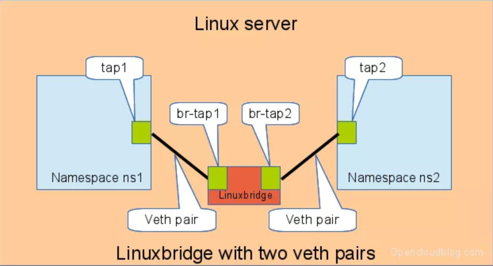
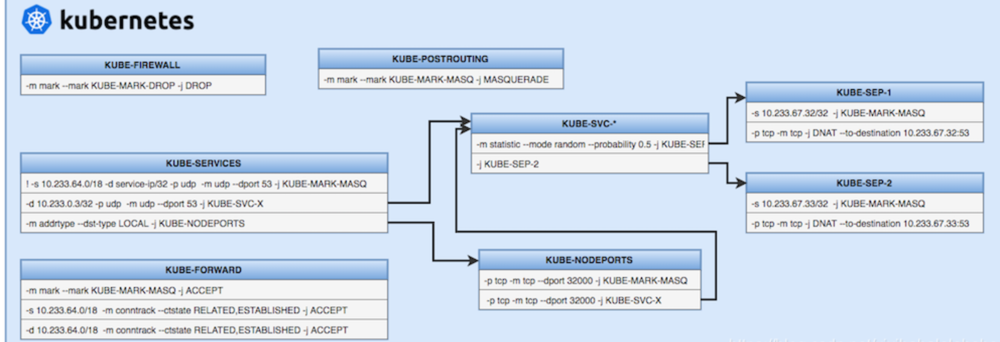
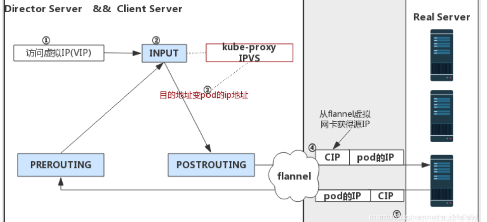
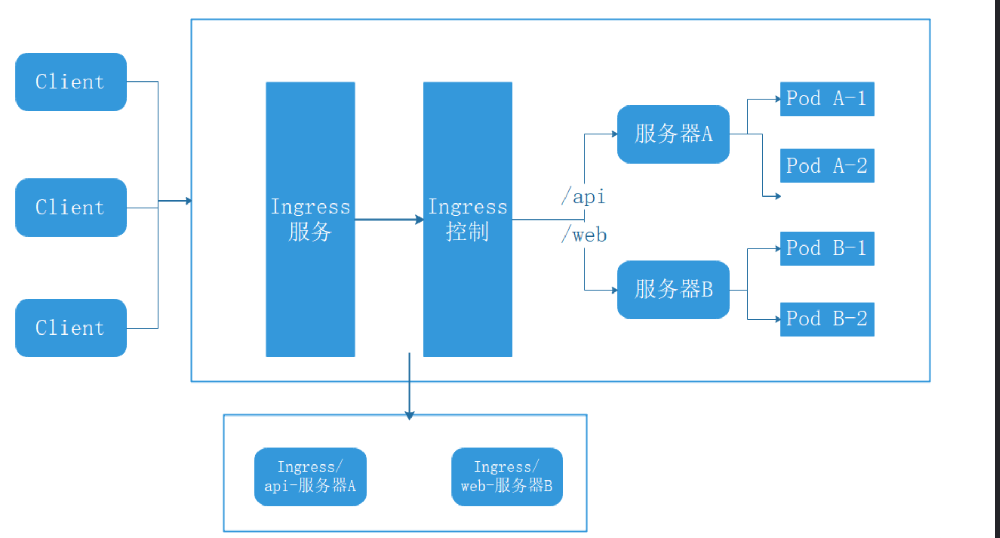
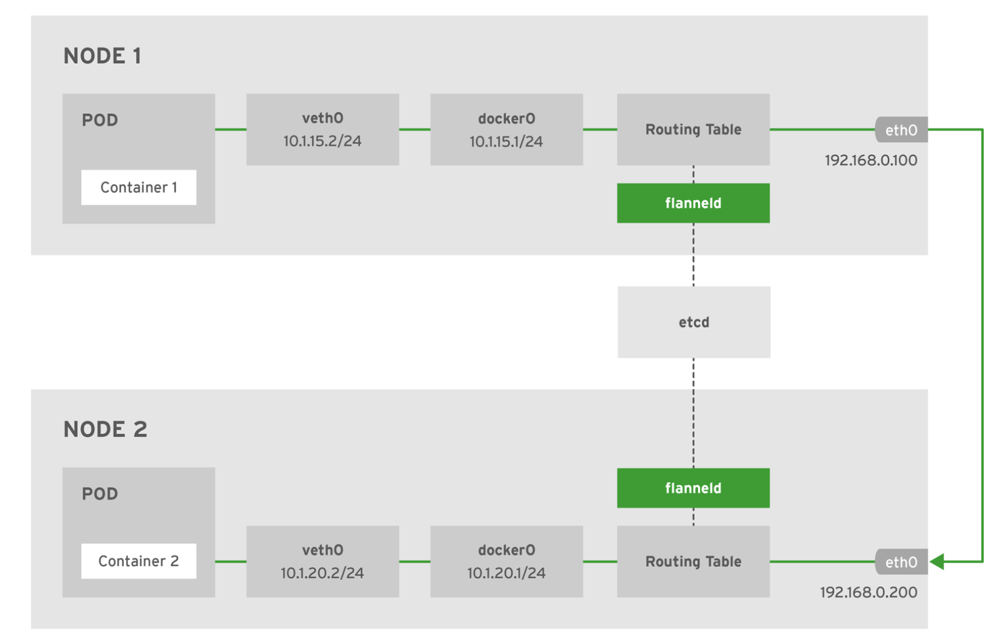
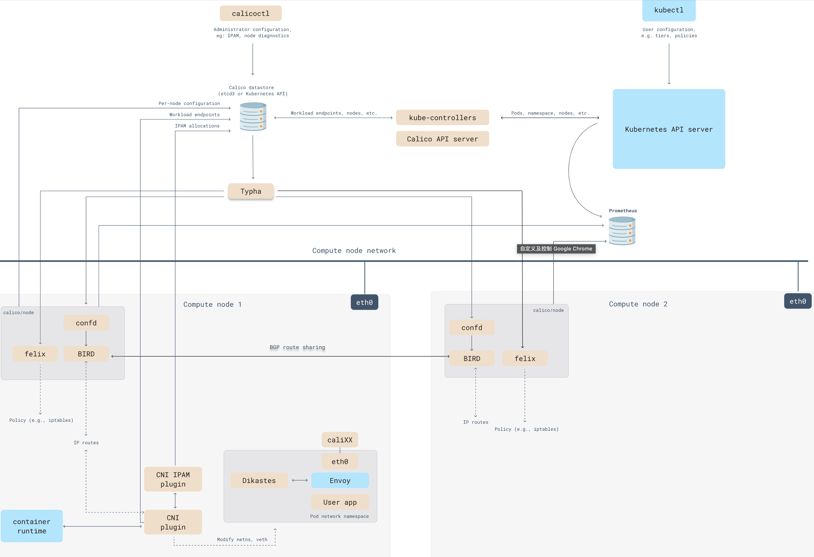

### 网络基础

#### docker网络基础

   veth-pair：一对的虚拟设备接口，俗称网卡对。
   Linux Bridge 相当于一台交换机，可以中转两个      namespace的流量，veth-pair连通namespace到bridge的网络。
   容器网络原型：veth pair的2端绑定到namespace和网桥，将多播的vxlan0网卡绑定到网桥。 namespace可以互通。

* veth-pair演示：

```
创建namespaceip netns a ns1
ip netns a ns2
创建一对 veth-pair veth0 veth1
ip l a veth0 type veth peer name veth1
将 veth0 veth1 分别加入两个 ns
ip l s veth0 netns ns1
ip l s veth1 netns ns2
给两个 veth0 veth1 配上 IP 并启用

ip netns exec ns1 ip a a 10.1.1.2/24 dev veth0
ip netns exec ns1 ip l s veth0 up
ip netns exec ns2 ip a a 10.1.1.3/24 dev veth1
ip netns exec ns2 ip l s veth1 u
ping测试

ip netns exec ns1 ping 10.1.1.3
ip netns exec ns2 ping 10.1.1.2
```

图示：veth-pair连接图



* 容器出站网络
  容器的网络协议栈----》容器的eth0----》虚拟网卡veth（veth一端对接容器的eth0，一端对接docker0网桥）---------》docker0网桥------》主机的eth0------》外网
  docker使用的是veth pair的网络模式，连接eth0和docker0网桥，来实现容器对本级的访问。
  docker的端口映射：原理是修改了iptables的nat表，可以使用查看：iptbales  -t  nat  -nL
  docker访问外网：1. ip_forward的转发功能，2. docker 会自动在SNAT/MASQUER-ADE上新增一条转发替换规则。

#### Kubernetes网络
* 网络参考地址
  https://kuboard.cn/learning/k8s-intermediate/service/network.html#kubernetes%E7%BD%91%E7%BB%9C%E6%A8%A1%E5%9E%8B-2

* Kubernetes网络基础
  新建pod：kubelet调用CRI(容器运行接口)后面的dockershim,containerd创建容器，首先会创建pause容器，占用一个linux的network namespace，CNI(容器网络接口)会去创建pod的eth0，其他的网络插件去分配pod的IP , 其他的业务容器加入这个并共享network namespace。
  K8S主机内组网模型：使用veth pair将pod和linux网桥连接起来。
  K8S垮主机组件模型：1. 增加路由表。2.使用第三方网络插件类似flannel
  flannel原理：增加一个flannel1网口，即overlay隧道网络的入口，借助etcd记录容器IP与主机IP的对应关系，对flannel1的数据包就行封包(封装一层主机IP)和解包(找到真实的容器IP)操作，然后到达目标主机的cni0给目的容器
* Kubernetes的DNS
  CNI容器网络接口：默认的读取插件路径 /etc/cni/net.d ，默认存放插件二进制文件路径 /opt/cni/bin
  DNS服务部署好之后，会固定一个clusterIP，内部服务通过clusterIP+53端口访问。
  DNS的配置策略:   每个Pod所使用的DNS策略，是通过pod.spec.dnsPolicy字段设置的，共有4种DNS策略.
  ClusterFirst：默认策略，表示使用集群内部的CoreDNS来做域名解析，Pod内/etc/resolv.conf文件中配置的nameserver是集群的DNS服务器，即svc中kube-dns的地址。
  Default：Pod直接继承集群node节点的域名解析配置，也就是，Pod会直接使用宿主机上的/etc/resolv.conf文件内容。
  None：忽略k8s集群环境中的DNS设置，Pod会使用其dnsConfig字段所提供的DNS配置，dnsConfig字段的内容要在创建Pod时手动设置好。
  ClusterFirstWithHostNet：宿主机与 Kubernetes 共存,这种情况下的POD，既能用宿主机的DNS服务，又能使用kube-dns的Dns服务,需要将hostNetwork打开。
  例子：

  ```
  kubectl get pod titan-deploy -A -o yaml |grep dnsPolicy
  kubectl  get svc -A |grep kube-dns
  cat /etc/resolv.conf  
  ```

  代表当查询的域名字符串内的点数超过5时，则认为是完整域名，直接解析。否则根据查询，会自动取补全域名后缀。
  DNS解析问题排查:

  ```
  #登录pod查看dns解析
  kubectl  exec -it busybox  -- nslookup kubectl.default 
  #查看pod的DNS配置舒服正确  
  kubectl  exec  busybox   cat  /etc/resolv.conf   
  #查看kube-dns的cluster-ip是否正确
  kubectl  get svc -A |grep kube-dns 
  #查看svc的endpoint是否绑定好      
  kubectl  get ep  --namespace=kube-system
  ```

  kubernetes网络策略：
          例子：
  deny-all流量
           Egress：表示出站流量
           Ingress：表示进站流量
           podSelector：指定网络策略在哪些pod上生效
           policyTypes：指定策略类型，包含Egress和Ingress
  **kubernetes网络实现机制**
  service的3个port: port表示service暴露的端口，targetport表示pod的映射端口，nodeport表示宿主机的访问端口
  发布形式：
* cluster ip  适合集群内部clister-ip访问，内部可以使用域名访问，
* load balancer  内部使用clister-ip访问，外部使用external-ip访问，不需要主机开放端口。
* nodeport  内部使用clister-ip访问，外部使用node-ip访问，会占用node的端口。
* headless service 没有selecor的service，需要手动指定后端的endpoints
* ingress  是外界访问集群内部service的路由，需要结合控制器动态写入负载均衡的配置。相当于service的代理

Endpoints Controller 是负责生成和维护所有 Endpoints 对象的控制器，监听 service 和对应 pod 的变化，当 pod 处于 running 且准备就绪时，endpoints controller 会将 pod ip 记录到 endpoints 对象中
Kube-proxy会监控Servcie和Endpoints的更新，并调用其Load Balancer模块刷新路由转发规则。kube-proxy的Load Balancer模块实现有userspace(已弃用)，iptables，ipvs三种机制。

这种模式，kube-proxy 会监视 Kubernetes 控制节点对 Service 对象和 Endpoints 对象的添加和移除。 对每个 Service，它会配置 iptables 规则，从而捕获到达该 Service 的 clusterIP 和端口的请求，
进而将请求重定向到 Service 的一组后端中的某个 Pod 上面。 对于每个 Endpoints 对象，它也会配置 iptables 规则，这个规则会选择一个后端组合。
如果 kube-proxy 在 iptables 模式下运行，并且所选的第一个 Pod 没有响应，则连接失败。Pod 就绪探测器 验证后端 Pod 可以正常工作，以便 iptables 模式下的 kube-proxy 仅看到测试正常的后端。
iptables -S -t nat   可以查看相关的iptables规则
ClusterIP模式：新建3条链表，KUBE-SERVICES  转发到   KUBE-SVC-****  转发 （这里实现负载）KUBE-SEP-*** 转发  pod
NodePort模式：PREROUTING(DNAT)   转发  KUBE-NODEPORTS-***  转发 KUBE-SVC-***转发  FORWARD  转发  POSTROUTING   转发  pod
现在的k8s默认模式，性能好，缺点是大规模集群时，导致iptables的链表特别大，查询消耗大。
如图



ipvs是借鉴了lvs模式的负载均衡。
ipvs和iptables的区别很大，ipvs模式会新建一个kube-ipvs0的虚拟网卡，ClusterIP会绑定在这个网卡上，所以ipvs的ClusterIP是可以ping通的。
因为service cluster ip 绑定到虚拟网卡kube-ipvs0上，内核可以识别访问的 VIP 是本机的 IP.
ipvs的网络流程：



ipvs监听到达input链的数据包，比对数据包请求的服务是为集群服务，修改数据包的目标IP地址为对应pod的IP，
然后将数据包发至POSTROUTING链.
数据包经过POSTROUTING链选路，将数据包通过flannel网卡发送出去。从flannel虚拟网卡获得源IP.
pod接收到请求之后，构建响应报文，改变源地址和目的地址，返回给客户端。
IPVS 提供了更多选项来平衡后端 Pod 的流量；这些是：

* rr: 循环赛
* lc: least connection（最少打开的连接数）
* dh: 目的地散列
* sh: 源哈希
* sed: 最短的预期延迟
* nq: 从不排队

ingress
  ingress controller: nginx controller , Traefik
  Ingress 可为 Service 提供外部可访问的 URL，
  Ingress 不会公开任意端口或协议。 将 HTTP 和 HTTPS 以外的服务公开到 Internet 时，通常使用 Service.Type=NodePort 或 Service.Type=LoadBalancer 类型的 Service。



**ingress的工作原理**
（1）ingress-controller通过和 kubernetes APIServer 交互，动态的去感知集群中ingress规则变化，
（2）然后读取它，按照自定义的规则，规则就是写明了哪个域名对应哪个service，生成一段nginx配置，
（3）再写到nginx-ingress-controller的pod里，这个ingress-controller的pod里运行着一个Nginx服务，控制器会把生成的 nginx配置写入 /etc/nginx.conf文件中，
（4）然后reload一下使配置生效。以此达到域名区分配置和动态更新的作用

#### kubernetes的网络插件

cni：cni会去创建pod的eth0，然后给pod分配ip，对接第三方的网络插件。
flannel的网络模式：udp ，vxlan  ,   host-gw ...
vxlan：虚拟可扩展的局域网，一种overlay全覆盖技术，通过3层网络搭建虚拟的二层网络。flannel网络插件使用
flannel的主要2个功能：
为每个 node 分配 subnet，容器将自动从该子网中获取 IP 地址。配置信息存在了etcd中。
当有 node 加入到网络中时，为每个 node 增加路由配置
flannel的网络传输流程图：



**flannel网络过程**：
IP数据报被封装并通过容器的eth0发送
Container1的eth0通过veth对与Docker0交互并将数据包发送到Docker0，然后Docker0转发包
Docker0确定Container3的IP地址，通过查询本地路由表到外部容器，并将数据包发送到虚拟NIC Flannel0
Flannel0收到的数据包被转发到Flanneld进程， Flanneld进程封装了数据包通过查询etcd维护的路由表并发送数据包通过主机的eth0
数据包确定网络中的目标主机主机
目的主机的Flanneld，负责解封包
解封装的数据包将转发到虚拟 NIC Flannel0
Flannel0查询路由表，解封包，并将数据包发送到Docker0
Docker0确定目标容器并发送包到目标容器
在常用的vxlan模式中，涉及到上面步骤提到的封包和拆包，这也是Flannel网络传输效率相对低的原因。

**host-gw:**
Calico是一个纯三层的方法，使用虚拟路由代替虚拟交换，每一台虚拟路由通过BGP协议传播可达信息（路由）到剩余数据中心；
Calico在每一个计算节点利用Linux Kernel实现了一个高效的vRouter来负责数据转发，而每个vRouter通过BGP协议负责把自己上运行的workload的路由信息像整个Calico网络内传播——小规模部署可以直接互联，大规模下可通过指定的BGP route reflector来完成。
核心组件：
Felix： Calico agent，跑在每台需要运行 workload 的节点上，主要负责配置路由及 ACLs 等信息来确保 endpoint 的连通状态；
etcd： 分布式键值存储，主要负责网络元数据一致性，确保 Calico 网络状态的准确性；
BGPClient(BIRD)： 主要负责把 Felix 写入 kernel 的路由信息分发到当前 Calico 网络，确保 workload 间的通信的有效性；
BGP Route Reflector(BIRD)： 大规模部署时使用，摒弃所有节点互联的 mesh 模式，通过一个或者多个BGP Route Reflector来完成集中式的路由分发；
calico的3中运行模式：ip-ip(默认)，BGP 网络模式，cross-subnet 模式
calico: 所有的数据包都是通过路由的形式找到对应的主机和容器的，然后通过 BGP 协议来将所有路由同步到所有的机器或数据中心，从而完成整个网络的互联。
pod通信：pod虚拟网卡 ---》本机tun0网卡---》路由到对应node节点的tun0网卡---》pod虚拟网卡
网络原型图：



扩展
lstio: 官方的介绍，服务治理涉及连接（Connect）、安全（Secure）、策略执行（Control）和可观察性（Observe)
lstio对k8s网络的一个扩展。
