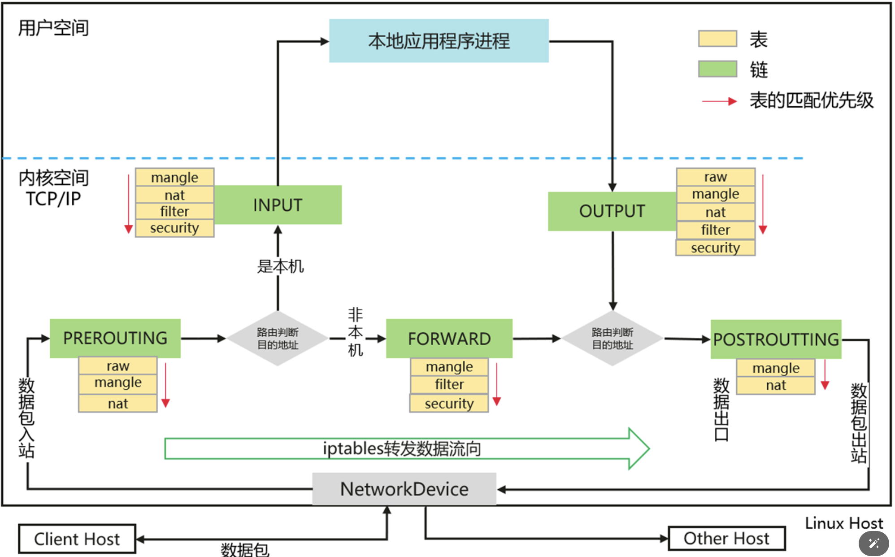

iptable的流量链路：

流量原理：

入口链路prerouting---(然后依次经过raw, mangle,nat三个表，可能会跳转到其他链路，最终还是会回到主链路)

如果目的ip是本机，则走到input链---(依次经过mangle,nat,filter,security四个表)---然后走到output链---(依次路过raw,mangle,nat,filter,security)

然后目的ip不是本机，则需要走到forward链---(依次经过mangle,filter,security)---(转发需要开通linux系统的net.ipv4.ip_forward=1)

最终出服务器的链路是postroutting---(依次经过mangle和nat表，主要是看是否需要源目地址转换)---然后通过eth0出去。

路由：

route -n : 查看main路由表，优先级是32766

ip  rule :  查看路由测试，可以通过ip  rule 插入指定优先级的路由策略

ip  route  show   table  tablename：查看路由策略对应的路由表规则
